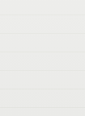
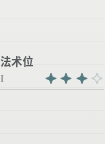
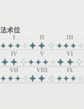
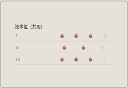
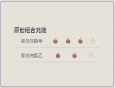
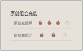

# 自适应快捷栏法术位图标 · 独立修复候选

基线为远端 main `9dbbc384f8ae9b6d190c5d001602d42a44cd6820`，保留三入口250发布记录。
当前250运行源码为 `ae6d213676d8eca71436e34c2400a5261479ecca`；本候选未合并、未部署，不改变版本号。
玩家反馈为新版Edge开启自适应后图标消失但点击有效，实际版本未知。玩家有三张截图，
当前邮件接口不能读取其octetstream，未看过原图；下方是独立原创夹具复现，不能代替原设备验收。

## 已确认的生产复现

实际 Quickbar → ResourceWidgets → ResourceModuleFace，普通standalone生产构建，
没有开发服务器、替代组件或规则库快照。测试角色与来源数据均为原创软件夹具，
不读取、导入或修改玩家数据，不联系玩家。隔离浏览器上下文通过真实导入入口打开夹具。

| Edge154 / 390px / 单层法术位 | A4 | 自适应修复前 | 自适应修复后 |
|---|---:|---:|---:|
| 分组及内容高度 | 43.734px | 0px | 143.328px |
| 第一个SVG高度 | 7px | 14px | 14px |
| SVG带来的实际可见像素数 | 75 | 0 | 见逐场景记录 |
| 模块坐标和尺寸 | 0,0 / 6×4 | 同左 | 同左 |
| 打开资源操作并关闭 | 可用 | 可用 | 可用 |

SVG存在且bbox为14px不能证明它绘出。测试截图同一按钮，再仅隐藏其inline SVG，
在浏览器canvas解码两幅PNG并逐像素比较RGB，记录最大通道差大于10的像素数。
原12项仅断言SVG尺寸和有高度分组的纵向边界，尚未检查横向及全部祖先；不以按钮大小、DOM可见或外部图片请求代替绘制证据。
实际两种浏览器UA、三次模式切换的group/content/SVG尺寸、网格尺寸和像素数见
[机器记录](data/responsive-spell-icons-20261007.json)。






## 原因、历史与最小改动

法术位及契约位即使只有一个等级也走rm-group；图标是代码内inline SVG，
没有依赖外部图片、字体图标或mask。自适应分组容器原为height:auto和inline-size containment，
里面rm-content为height:100%和size containment。实测内部尺寸包含使内容不能撑起自动高度，
分组为0px，overflow:hidden裁掉仍有14px bbox的SVG；点击由外面有高度的button承担。
自定义padding/border只剩边缘高度，也不能完整显示内部图标。

仅将自适应rm-group的height:auto改成height:100%，使用原模块已有确定高度。
保留容器查询、内容缩放、图标/色调/背景/边框/间距、固定攻击分割与12×6模块几何。
未改角色、法术位容量/消费、自动化choices、Data锁、发布门禁或规则来源。

不能称为250新引入：height:auto由`54d49b8f`于2026-10-01加入；rm-content包装由
`370c96a2c4dd7d584a43fd59aa50d8935e2670af`于10-02加入；默认padding/border为0由
`2a1004c4ac19b97205b8eb25b2edbfb028962399`于10-03设置。
这些历史日期来自实际Git记录，未逐个运行历史版本，不推断玩家首次遇到的版本。

## 验证和复现

真实Linux headless Edge154.0.4258.62（微软官方deb尺寸及SHA256已核对），Chromium153.0.8010.12。
原12项分别在390/1320px **viewport**、独立角色和上下文检查单层普通、九层普通、三层多职业共用、单层契约、四层契约及自定义共用法术组。
它们不是同一卡的pane resize，也未证明实际screen容器跨760px；custom-shared只代表外观自定义，不代表普通members组合。
每场景顺序A4→自适应→A4，检查真实绘制、SVG尺寸及rm-group纵向边界、资源操作条目数量、
布局网格不变及已存完整夹具角色JSON不变。Edge原基线12/12失败，修复后12/12通过；
Chromium修复后12/12通过，均无跳过或重试。初次诊断夹具错用了启动属性名，
其失败单独保留后改用既有data-card-startup；没有删除资源或绘制断言。

## 终审补充：同一卡的实际pane跨断点往返

只新增一组生产浏览器场景，不追加生产CSS改动。通过真实界面分隔条Home/方向键调节角色卡份额，
在同一上下文、同一已存角色和同一pane/viewport DOM节点，保持screen模式并将浏览器viewport从1000→1600→1000px。
没有注入pane宽高或替代布局；记录实际bbox和命名screen容器clientWidth，且检查容器查询对应的快捷栏高度：

| 实测Edge154 | 窄 | 宽 | 回到窄 |
|---|---:|---:|---:|
| 浏览器viewport宽度 | 1000 | 1600 | 1000 |
| sheet-pane bbox宽度 | 620 | 992 | 620 |
| 命名screen容器宽度/clientWidth | 605 | 977 | 605 |
| 快捷栏实际高度 | 215 | 150 | 215 |
| 三模块的分组高度 | 143.328 | 100 | 143.328 |

同一卡包括三层共用位、单层契约位，以及保存了`members:['manual-a','manual-b']`的普通组合。
普通组合同时使用火焰图标、色调、背景、圆角/边框、padding/gap和0.8缩放；断言真实两成员投影，
不把自定义法术外观算作members组合。各模块依次实际滚动进入可见资源页，测SVG的可见RGB像素，
并打开/关闭真实操作弹窗，检查对应条目数。共用/契约来自原创手动测试记录，未核对或授予施法规则。

逐SVG遍历全部实际裁剪祖先至html，检查横纵边界、scroll/client有效区、绘制containment、
两层实际切角convex polygon及圆角overflow；允许1 CSS像素几何误差。遇到未处理clip/mask或形状即失败，
不会把未知裁剪算作通过。每步完整已存角色JSON、资源、网格页码/位置/尺寸和DOM外观/图标保持一致。
Edge154与Chromium153均已跑过这一额外场景，无跳过/重试；增补后每种浏览器共13项，
最终精确提交及CI结果另存交付回执，旧acd816f的27绿灯不直接沿用于增补提交。

补测最初误把导入后的正常“（导入）”名称后缀当成失败；随后检测到两个真实polygon裁剪层，
先明确拒绝未知类型，再补上几何检查。所有初次失败、完整clip链、逐SVG bbox和截图均保留，
没有删除裁剪/存档断言。实际容器及逐模块精简数据见[补充机器记录](data/responsive-pane-roundtrip-20261007.json)。




原acd816f阶段相关五文件77个单元测试通过，TS及集成/standalone生产构建、现有runtime ledger验证通过。
终审增补只修改测试和记录，不重跑无改动的单元组；增补提交的类型/生产构建及两浏览器复测另留精确SHA回执。
没有lint脚本。本轮不重复战俑缓存/覆盖审计，不将CSS绘制修复扩大为整条规则可用。
精确最终提交复测与远端CI以PR及本地交付回执为准，不能用上述本机结果代替CI结果。

```bash
npm ci
npm run build:standalone
npx playwright install --with-deps msedge
DND_ICON_BROWSER_CHANNEL=msedge npx playwright test --config playwright.responsive-spell-icons.config.ts
npx playwright install --with-deps chromium
npx playwright test --config playwright.responsive-spell-icons.config.ts
```

专项CI独立跑上述两种真实浏览器及生产包，保存逐场景截图和JSON；测试目录与现有
开发服务器用例隔离，避免把开发服务或不同存储数据库当成此次生产复现。
Windows玩家Edge、原图、真实枭熊房间、实体手机仍未现场验收，不能称玩家反馈全部已关闭。

诊断、红绿日志、原失败trace、最终精确SHA/CI、源码patch和Git bundle保存在
`.local-evidence/responsive-spell-icons/`。回滚仅本候选实际提交：
`git revert --no-edit <本PR提交SHA>`，保留主线后续历史，不reset/force push。
