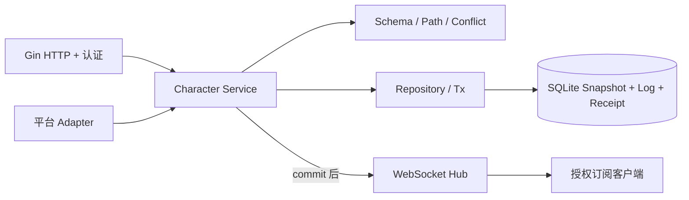

# 后端架构

实施前证据见 [AUDIT.md](AUDIT.md)。`backend` 是独立 Go 模块，模块化单体，所有角色状态保存在 SQLite JSON TEXT Snapshot。前端暂未改造，现有站点仍按旧逻辑运行，不会自动上传本地角色。

## 模块

- `cmd/server`：配置、日志、迁移、初始用户、优雅退出。
- `internal/auth`：Authenticator 可替换接口；本地令牌实现保存 SHA-256 摘要，CLI 配置用户；HTTP 和 WS 共用。
- `internal/character`：schema 迁移、校验、虚拟 ID 路径、operation 执行、冲突判断、revision、幂等及权限。无 React/浏览器/平台 SDK 依赖，不执行 D&D 自动规则。
- `internal/storage`：Repository/Tx 接口及 GORM 实现，维护聚合文档与回执事务；`storage/sqlite` 配置 WAL、单连接池和版本化 SQL migration。
- `internal/api/http`：Gin 路由、JSON/大小限制、错误映射、session cookie。
- `internal/api/websocket`：订阅、回放、非阻塞广播、keepalive、慢客户端处理。WS 不接收编辑操作。
- `internal/adapters`：纯输入输出转换接口、受权限约束的 pipeline Dispatch；fvtt/owlbear 子目录提供 HP 示例映射。
- `schemas`/`migrations`：嵌入可执行文件，运行不依赖工作目录中的源码文件。

## 写入顺序

初步校验 UUID、batch 数量和路径 → characterId 顺序锁 → 开事务 → 加载角色与权限 → 查幂等回执 → 限流 → 加载历史并检查冲突 → 在当前快照应用操作 → 校验完整结果 → revision+1 和 snapshot 更新 → 写 operation log 与 receipt → 清理旧日志及满足保留策略的过期回执 → commit → 非阻塞 Hub 入队 → 释放角色锁。无成功提交则无广播。网络发送在独立 writer goroutine 中；事务内无任何外部平台调用。

顺序锁表仅用一个短 mutex 管理引用计数：holder 和 waiter 均计数，最后一个引用释放才删除 keyed gate，避免等待者与新调用取得两个不同锁。不同角色的事务调用、commit后发布和订阅回放可以独立推进；Create 使用新 UUID，无需占用任何角色 gate。限流表有独立短锁，不覆盖数据库或 Hub。SQLite 本身仍为单连接/单写入者，不声称数据库写事务并行。

Schema/Apply 在事务内处理有界文档，避免基于陈旧版本提交。操作数、文档大小、历史回放字节上限限制 CPU 工作。SQLite 单写入者适合本阶段写少连接多；长连接不占数据库连接。最大数据库连接数/空闲数均为1，避免 deferred transaction 升级锁争用；未来需要更多读吞吐可引入只读连接池，但必须保持同一事务的授权和 revision 一致性。

## 同步一致性

Snapshot 是当前唯一权威状态；Operation Log 是有限历史，不是重建数据库所必需的 event sourcing。revision 每张卡独立，从1开始；所有成功新 batch（包括 no-op）增加1。operation_receipts 保留成功请求 hash 和原结果，默认至少90天且保留最近10000 revision，独立于短 log 窗口；过期原请求不会重新执行，但可能要求人工核对，见 [DATABASE](DATABASE.md) 和 [SYNC](../protocol/SYNC.md)。

落后提交读取 base+1 到 current 的全部连续历史。路径相等或父子关系冲突；同路径 inc/inc 可交换，仍要校验最后数值；其他重叠不默认 LWW。同一 ID 内父子路径冲突，不同实体 ID 通常独立。详见 [Operations](../protocol/OPERATIONS.md)。

同一角色订阅的历史查询、回放排队和注册与提交/广播使用同一个 Service keyed gate，消除查询与注册之间漏事件的窗口；权限事务及其 commit 后回调也在此 gate 内。Hub 自身锁只维护注册表；发送队列非阻塞。PermissionChanged 保留 viewer/editor 订阅；PermissionRevoked 只撤销指定角色，失效订阅令牌让其排队消息被丢弃，等待在途写入时不持有 Hub 注册锁。进程 commit 后崩溃而未发广播时，HTTP delta/重新订阅仍能从数据库恢复。

## 平台边界

Binding 含 provider/externalId/mappingVersion/origin/lastEventId/lastRevision/config。LastRevision 仅表示最后确认的服务器 Character revision，Dispatch.Batch.BaseRevision 从此取得；Event.Revision 仅表示外部平台版本/sequence，交给映射器处理，不可作为服务器 revision。未确认的 LastRevision=0 必须先读取授权服务器 snapshot。外部入站必须由经过认证且获角色权限的服务主体调用 Dispatch；operationId 由 bindingId+eventId 确定性 UUIDv5 生成。回环通过 origin/lastEventId 过滤；窗口内回执保证重放幂等。配置 `binding.origin` 为该绑定实际出站标签，例如 `adapter:fvtt:<bindingId>`，连接器必须原样传递。

Dispatch 不变更传入 Binding，也不持久化检查点。未来 connector 必须先保存 pending 事件的原 LastRevision/事件/payload，再提交；服务器确认后由 binding repository 原子更新检查点并完成 pending。未知结果始终以保存的原 base 和 body 重试，不能将新 LastRevision 填入旧事件，否则同 operationId 的请求 hash 会不同。出站检查点仅在服务器版本确认且外部送达后推进；外部事件 sequence 必须由 connector 另行保存。

Adapter 不持有数据库，只返回 Canonical Operation 或平台 patch。示例仅映射 FVTT `system.attributes.hp.value`、Owlbear `health` 到 `/runtime/hp`；inc 的平台绝对值输出需要读已提交 snapshot，不猜测值。完整 OAuth/平台凭证、网络连接器、绑定管理 API 和可靠出站队列未实现。后续连接器可消费可恢复 delta，送达成功后由专门 binding repository 更新检查点；不把检查点变更当角色修改，也不直接改 snapshot。

## PostgreSQL 演进

Character Service 依赖 Repository/Tx，不直接执行 SQLite SQL。迁移时提供 PostgreSQL 实现与 migration 组，将 document_json/operations_json 等改为 JSONB；事务使用行锁或相同 revision compare-and-swap，保留 operationId/character+revision 唯一约束与回执保留窗口。同步协议、Character JSON、JSON Pointer、客户端 revision 不变。多实例部署需要另行设计跨节点发布/排序，不在当前单实例 SQLite 模式中假装支持。
